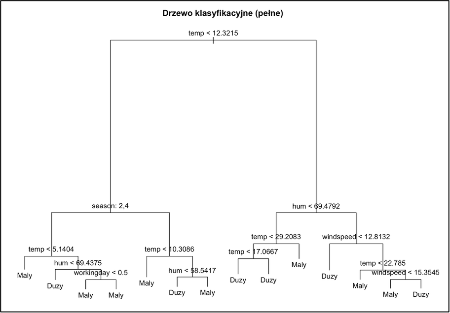

# Zastosowanie drzew decyzyjnych w analizie popytu na system rowerów miejskich

## Wstęp
Celem niniejszego projektu jest analiza czynników wpływających na liczbę wypożyczeń rowerów miejskich oraz budowa modelu predykcyjnego pozwalającego prognozować popyt.
Analizę oparto o dane historyczne obejmujące parametry pogodowe takie jak temperatura (temp), wilgotność (hum), prędkość wiatru (windspeed) oraz ogólna sytuacja pogodowa (weathersit) oraz parametry kalendarzowe: pora roku (season), dzień świąteczny (holiday) i dzień roboczy (workingday).
Badanie przeprowadzono budując dwa niezależne modele, model klasyfikacyjny przewiduje natężenie ruchu (duży/mały), natomiast model regresyjny przewiduje ile dokładnie rowerów zostanie wypożyczonych.

## Metodologia
Do analizy wykorzystano pakiet tree. W pierwszej kolejności dane surowe zostały przetworzone na wartości rzeczywiste.

### Zmienne Ilościowe
Oryginalne dane były znormalizowane (wartości 0-1). Aby wyniki były zrozumiałe, przeliczono je na jednostki fizyczne:
Temperatura (temp): Przeliczona na stopnie Celsjusza (zakres -8°C do 39°C).
Wilgotność (hum): Przeliczona na procenty (0-100%).
Prędkość wiatru (windspeed): Przeliczona na km/h.

### Zmienne Jakościowe
Zmienne kategorialne zostały przekonwertowane na faktory, aby algorytm nie traktował ich jak zwykłych liczb:
Pora roku (season): Podział na 4 okresy (1: Wiosna, 2: Lato, 3: Jesień, 4: Zima).
Sytuacja pogodowa (weathersit): Ogólna ocena (1: Słonecznie/Bezchmurnie, 2: Zachmurzenie/Mgła, 3: Lekki deszcz/Śnieg, 4: Ulewa/Burza).
Dzień świąteczny (holiday): Informacja, czy dany dzień jest świętem państwowym.
Dzień roboczy (workingday): Informacja, czy jest to dzień roboczy

### Zmienne Celu
Liczba wypożyczeń (cnt): Główna zmienna do modelu regresji (całkowita liczba rowerów).
Kategoria Ruchu (Ruch): Zmienna stworzona na potrzeby klasyfikacji. Dni podzielono na te o "Dużym" i "Małym" popycie, biorąc za punkt odcięcia średnią wartość z całego okresu.
Zbiór został podzielony losowo w proporcji 70:30. 70% danych posłużyło do treningu modelu, a 30% do testowania jego skuteczności.

## Teoria
Metoda drzew decyzyjnych polega na rekurencyjnym podziale zbioru danych na mniejsze podzbiory. W każdym kroku algorytm szuka reguły, która najlepiej rozdziela obserwacje na jednorodne grupy.

### Problem Przeuczenia
Algorytm ma tendencję do budowania zbyt skomplikowanych struktur. Drzewo pełne chce dopasować się do każdego pojedynczego przypadku w danych treningowych, co prowadzi do utraty zdolności generalizacji.

*Rys. 1. Drzewo decyzyjne przed optymalizacją. Duża ilość gałęzi wskazuje na zjawisko przeuczenia.*

### Przycinanie
Aby zbudować użyteczny model, zastosowano metodę przycinania. Zredukowano złożoność drzewa do 5 liści. Wyodrębniło to tylko najważniejsze reguły decyzyjne.

## Model Klasyfikacyjny
Celem modelu jest przewidzenie zmiennej binarnej Ruch (kategorie: duży/mały). 

### Struktura drzewa klasyfikacyjnego
Po przycięciu drzewa uzyskano model oparty na 5 kluczowych segmentach.

*Rys. 2. Finalne drzewo klasyfikacyjne.*

### Wizualizacja
Model pozwolił na wyrysowanie mapy popytu w zależności od temperatury i wilgotności.

*Rys. 3. Wizualizacja klasyfikacji. Obszar zielony (D) oznacza prognozowany duży ruch, a obszar czerwony (M) to mały ruch.*

### Wnioski
Najważniejszym czynnikiem okazała się temperatura. Poniżej progu 12,32°C popyt jest systematycznie klasyfikowany jako mały, niezależnie od innych czynników.
W dni ciepłe powyżej progu 12,32°C, ale wilgotne (>69,48%), o popycie decyduje wiatr. Słaby wiatr (< 12.8 km/h) sprzyja rowerzystom, więc ruch jest duży, natomiast silny wiatr zniechęca użytkowników i ruch jest mały.

## Model Regresyjny
Celem modelu jest prognoza dokładnej liczby wypożyczeń.

### Struktura drzewa regresyjnego
Model regresyjny również został ograniczony do 5 liści, co pozwoliło wyodrębnić główne czynniki wpływowe.

Rys. 4. Drzewo regresyjne. Liście mówią o średniej przewidywanej liczbie wypożyczonych rowerów.

### Wizualizacja
Poniższy wykres przedstawia podział danych na strefy w zależności od temperatury i prędkości wiatru. Czerwone liczby to predykcje modelu.

Rys. 5. Mapa regresji. Widoczna zmiana wpływu wiatru po przekroczeniu progu 12°C.

### Wnioski
Wykres pokazuje, że użytkownicy zupełnie inaczej reagują na wiatr w zależności od tego, czy jest zimno, czy ciepło. Granicą jest tutaj około 12°C.
Gdy jest zimno (poniżej 12°C) to decyduje tylko temperatura. Na wykresie widać pionowe linie, oznacza to, że ludzie rezygnują z roweru głównie przez chłód. Siła wiatru nie ma tu większego znaczenia, bo popyt i tak jest niski.
Gdy jest ciepło (powyżej 12°C), to w takim wypadku wiatr staje się decydujący (poziome linie podziału). Przy słabym wietrze notujemy rekordowe wyniki (średnio 6510 wypożyczeń). Gdy wiatr nasila się (powyżej 12 km/h), liczba wypożyczeń spada drastycznie do około 4600, nawet jeśli temperatura jest wysoka.

### Ocena Dokładności
Model osiągnął błąd średniokwadratowy RMSE równy ok. 1350 rowerów. Symulację przeprowadzono na podstawie finalnego, przyciętego drzewa dla idealnych warunków (lato, 25°C, słonecznie, wiatr 15 km/h, wilgotność na poziomie 50%).

Rys. 6. Wynik symulacji w konsoli R.

## Podsumowanie
Z modelu wynika, że klasyfikacja jest dobra do szybkiego ostrzegania, np. dla właściciela, który może decydować o liczbie pracujących danego dnia mechaników.
Regresja pozwoliła natomiast wykryć, że podczas ciepłych dni decydującą rolę odgrywa wiatr. Analiza wykazała, że silne podmuchy potrafią skutecznie zniechęcić użytkowników i obniżyć popyt, nawet przy wysokiej temperaturze.
Plusem modelu jest przejrzystość. Model jest prosty do interpretacji (np. jeśli temperatura jest mniejsza niż pewna wartość, to ruch spada). Minusem jest to, że model jest schodkowy. Wartości 20 stopni i 35 stopni mogą być traktowane jako ta sama kategoria "Ciepło", podczas gdy w rzeczywistości przy tak wysokiej temperaturze ruch mógłby spaść przez upał.
Analiza przy użyciu drzew decyzyjnych wskazała, że temperatura jest głównym czynnikiem decydującym o liczbie wypożyczeń. Jednak w ciepłe dni wysoka wilgotność i silny wiatr stają się kluczowymi barierami, które mogą skutecznie obniżyć popyt. Model stanowi praktyczne narzędzie, które może wspomagać decyzje biznesowe wypożyczalni.

**Źródło danych:** UCI Machine Learning Repository (Bike Sharing Dataset) [https://archive.ics.uci.edu/dataset/275/bike+sharing+dataset]

